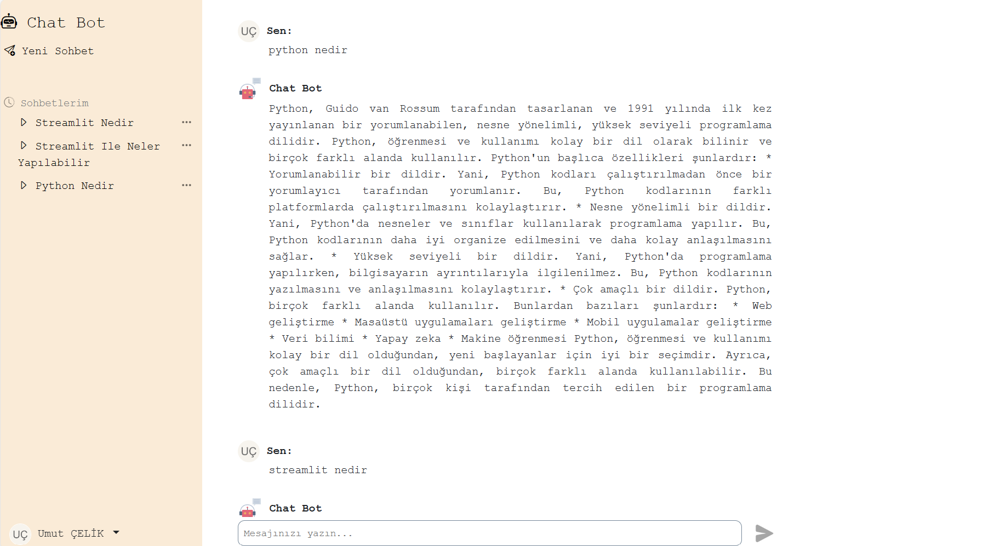
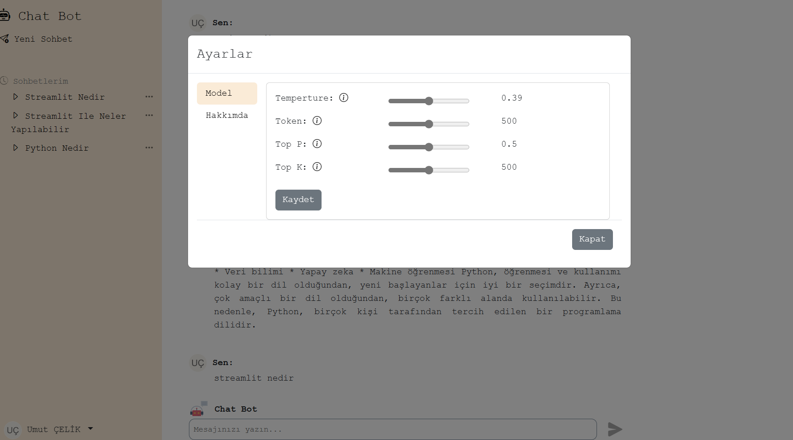

# Gemini ChatBot Project


## Authors

- [umutins62](https://www.github.com/umutins62)


## Installation

Install git

```bash
  git init
  git clone https://github.com/umutins62/my_ai_chatbot.git
```
    
## Usage/Examples
.env
----------
SECRET_KEY=""
DEBUG=True
ALLOWED_HOSTS=127.0.0.1,localhost
CSRF_TRUSTED_ORIGINS=http://*.127.0.0.1,http://*.localhost
GOOGLE_API_KEY=""
```

GOOGLE_API_KEY = env("GOOGLE_API_KEY")
genai.configure(api_key=GOOGLE_API_KEY)


 model = genai.GenerativeModel('gemini-pro')

        response = model.generate_content(
            message,
            generation_config=genai.types.GenerationConfig(
                # Only one candidate for now.
                candidate_count=1,
                max_output_tokens=token,
                temperature=temperature,
                top_p=top_p,
                top_k=top_k,
            )
        )

        all_mesages = []
        for chunk in response:
            all_mesages.append(chunk.text)

        string = " ".join(all_mesages) 

## Screenshots





